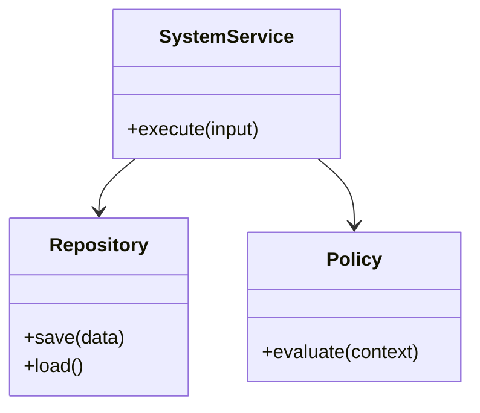
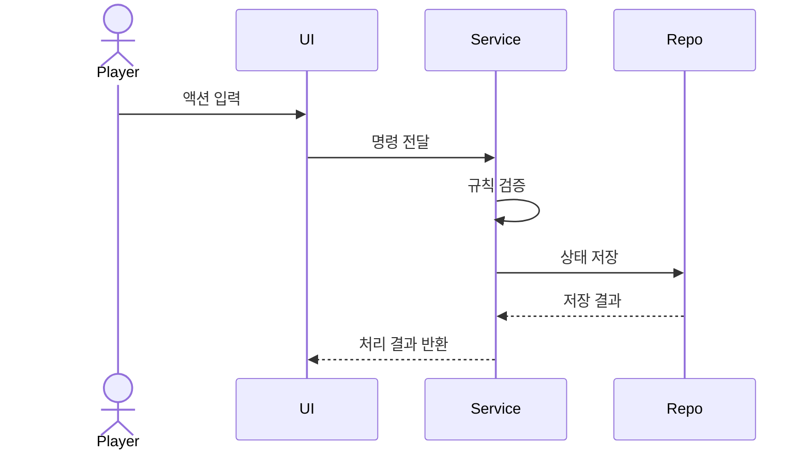

# 시스템 명세 템플릿

> 이 문서는 특정 시스템(예: 드론 할당, 채집, 저장)의 구현 명세를 정의합니다.
> 이 문서만으로 개발 가능한 수준까지 구체화하는 것을 목표로 합니다.

---

## 1) 범위 및 목표

- 시스템 이름:
  - TODO:
- 목적(Why):
  - TODO:
- 이번 범위(In Scope):
  - TODO:
- 제외 범위(Out of Scope):
  - TODO:
- 완료 조건(Definition of Done):
  - TODO:

---

## 2) 용어 정의

| 용어 | 의미 |
|---|---|
| TODO | TODO |

---

## 3) 구조 명세 (클래스 다이어그램)

- 책임 경계:
  - TODO:
- 의존 방향/소유권:
  - TODO:

---

## 4) 흐름 명세 (시퀀스 다이어그램)

- 정상 흐름:
  - TODO:
- 예외/실패 분기:
  - TODO:

---

## 5) 인터페이스 계약

### 입력/출력

| 항목 | 타입 | 설명 | 제약 |
|---|---|---|---|
| TODO | TODO | TODO | TODO |

### 이벤트/에러 규약

| 구분 | 이름 | 설명 | 처리 방식 |
|---|---|---|---|
| Event/Error | TODO | TODO | TODO |

---

## 6) 상태 및 비즈니스 규칙

- 상태 목록:
  - TODO:
- 상태 전이 규칙:
  - TODO:
- 계산 규칙:
  - TODO:
- 제약조건:
  - TODO:

---

## 7) 비기능 요구사항

- 성능 목표:
  - TODO:
- 저장/복구 기준:
  - TODO:
- 안정성/동시성 기준:
  - TODO:

---

## 8) 테스트 시나리오

| ID | 시나리오 | 기대 결과 | 우선순위 |
|---|---|---|---|
| T-001 | TODO | TODO | High/Med/Low |

---

## 9) 변경 이력

| 날짜 | 변경 내용 | 작성자 |
|---|---|---|
| YYYY-MM-DD | 최초 작성 | TODO |
